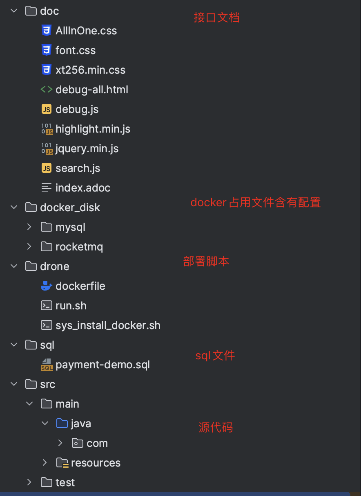

# 支付宝沙箱简单实例

### 完成功能：

1. 生成订单
2. 调用支付宝接口支付
3. 退款
4. 超时支付

 

### 项目依赖：

1. springboot
2. mybatis-plus-boot		-- mybatis 加强
3. hutool
4. alipay-sdk-java			--沙箱支付依赖包
5. lombok
6. rocketMQ					--消息队列 用于实现超时未支付关闭订单
7. smart-doc    				--生成接口文档openapi 供前端生成axios
8. mysql8.0
9. jdk1.8

 

### 快速开始

- #### 注册支付宝开发者账户

  > https://openhome.alipay.com/platform/developerIndex.htm

- 沙箱入口

  > https://open.alipay.com/develop/sandbox/app

- 项目目录介

  > 

 

### 快速部署

1. > 在项目中drone文件中运行 sys_install_docker.sh 安装 docker，docker-compse

2. > 运行根目录 docker-compose-mac.yml 启动项目基本环境

3. > cd drone/ 运行 run.sh 构建项目镜像

4. > ip:9000 portainer docker看板，查看运行情况

5. > drone：自动化部署暂加